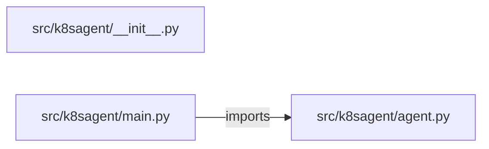

# mcp-kubernetes-agent — project architecture

[README](README.md) · [Interview questions and answers](INTERVIEW_QA.md)

## Purpose and scope

`mcp/tools.json` lists get_pods, read_logs, and render_manifest. The agent refuses `latest`, a replica count outside 1 to 5, and any goal that applies or deletes. `applied` stays false.

This document describes files and symbols in this checkout. Deployment templates and statements in the original overview are distinguished from a verified running environment.

## Component diagram



For Python repositories, arrows show resolved local imports, not network calls or deployment order. Otherwise the diagram is a repository component map; containment arrows do not assert runtime integration.

## Components and responsibilities

| Component | Responsibility |
| --- | --- |
| [`src/k8sagent/main.py`](src/k8sagent/main.py) | HTTP handlers: `POST /agent/run` |
| [`src/k8sagent/agent.py`](src/k8sagent/agent.py) | Functions: `run` |
| [`requirements.txt`](requirements.txt) | Implementation or supporting configuration |
| [`src/k8sagent/__init__.py`](src/k8sagent/__init__.py) | Implementation or supporting configuration |
| [`tests/test_k8sagent.py`](tests/test_k8sagent.py) | Executable checks and regression examples |
| [`.github/workflows/ci.yml`](.github/workflows/ci.yml) | GitHub Actions job definitions |
| [`README.md`](README.md) | Project explanations or operating notes |

## Request interface

| Method and path | Handler | Source |
| --- | --- | --- |
| `POST /agent/run` | `post_run` | [`src/k8sagent/main.py`](src/k8sagent/main.py#L7) |

The table lists literal route decorators found in the inspected Python modules. Router prefixes and middleware can add behavior; check the linked handler and application setup before calling an endpoint.

## Implementation walkthrough

### `run(goal, image, replicas)`

Source: [`src/k8sagent/agent.py`](src/k8sagent/agent.py#L6).

Calls visible in this function: `any`, `goal.lower`, `image.endswith`.

```python
def run(goal, image, replicas):
    names = [tool["name"] for tool in TOOLS]
    if image.endswith(":latest") or ":" not in image:
        return {"refused": True, "reason": "Pin an image tag. latest is refused.", "applied": False, "tools": names}
    if not 1 <= replicas <= 5:
        return {"refused": True, "reason": "Replicas must be from 1 to 5.", "applied": False, "tools": names}
    if any(word in goal.lower() for word in ("apply", "delete", "prod")):
        return {"refused": True, "reason": "This agent does not apply to a cluster.", "applied": False, "tools": names}
    manifest = {"kind": "Deployment", "image": image, "replicas": replicas, "resources": {"cpu": "100m", "memory": "128Mi"}}
    return {"refused": False, "tools": names, "manifest": manifest, "applied": False}
```

## Data flow and design decisions

### What is the input-to-output contract of `run`

In [`src/k8sagent/agent.py`](src/k8sagent/agent.py#L6), `run(goal, image, replicas)` receives the inputs. The function computes these intermediate values:

- `names = [tool['name'] for tool in TOOLS]`
- `manifest = {'kind': 'Deployment', 'image': image, 'replicas': replicas, 'resources': {'cpu': '100m', 'memory': '128Mi'}}`

Its result is defined by:

- `{'refused': False, 'tools': names, 'manifest': manifest, 'applied': False}`
- `{'refused': True, 'reason': 'Pin an image tag. latest is refused.', 'applied': False, 'tools': names}`
- `{'refused': True, 'reason': 'Replicas must be from 1 to 5.', 'applied': False, 'tools': names}`

### Which decision rules or boundary conditions should an interviewer challenge

The implementation in [`src/k8sagent/agent.py`](src/k8sagent/agent.py#L6) branches on:

- `image.endswith(':latest') or ':' not in image`
- `not 1 <= replicas <= 5`
- `any((word in goal.lower() for word in ('apply', 'delete', 'prod')))`

A useful extension is a table-driven test that covers each condition just below, at, and above its boundary where applicable. These expressions are the current rules; changing them changes behavior and should be justified by the project’s acceptance criteria.

## Setup and verification

The following commands are derived from the checked-in dependency/test contracts. Execute them from the repository root; the block prepares a local environment, not a cloud deployment.

```bash
python3 -m venv .venv
source .venv/bin/activate
python -m pip install -r requirements.txt
python -m pytest -q
```

Python dependencies: [`requirements.txt`](requirements.txt).

Test entry points: [`tests/test_k8sagent.py`](tests/test_k8sagent.py).

Automation definitions: [`.github/workflows/ci.yml`](.github/workflows/ci.yml). Read their triggers and job steps to determine what CI actually runs.

## Operating boundaries and design review

Before turning this checkout into a customer deployment, establish the input contract, data ownership, access controls, failure response, evaluation criteria, and rollback owner. Repository fixtures and unit tests demonstrate local behavior; they do not establish throughput, uptime, compliance, or business impact.

A useful architecture review starts with the linked implementation: identify where input enters, where a decision is made, which state can change, and which external dependency can fail. Add a deployment view only for infrastructure that is actually configured and exercised.
